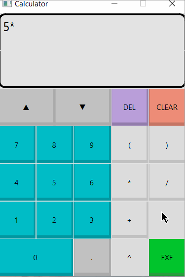

# Qt Calculator

Qt Calculator is a project application that allows users to calculate an expression with multiple basic operations and parentheses and powers at once. The user can also cycle through the history of the previous ten expressions that were executed.

Submitted by: James Vera-Soto

## Tools

* C++
* Qt

## Video Walkthrough

Here's a walkthrough:

GIF created with [LiceCap](http://www.cockos.com/licecap/).
